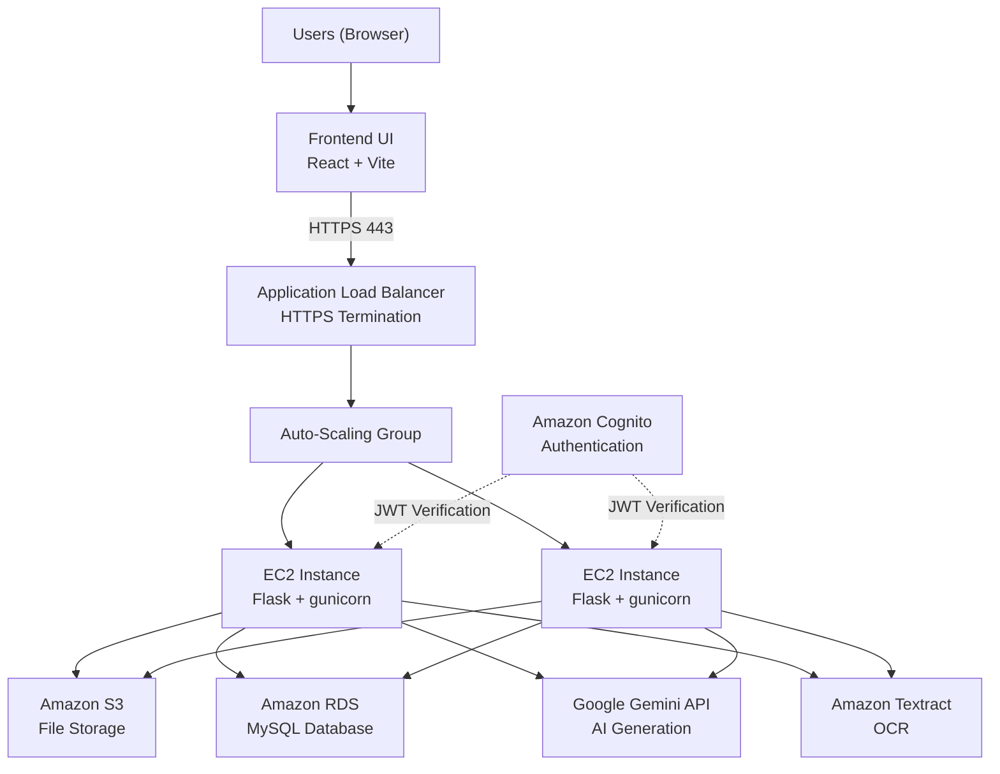

# CloudStudy: AI-Powered Study Assistant

> Singapore Institute of Technology  
> CSD3156 Mobile and Cloud Computing  
> AY 2025/2026, Trimester 2  
> Cloud Computing Project Team 10

CloudStudy is a cloud-based web application that helps students study more effectively. Students upload their study materials (PDFs, Word documents, Markdown, plain text, or images) and the system automatically extracts text and uses AI to generate summaries, quiz questions, and flashcards.

Preparing structured study content manually is time-consuming. CloudStudy automates this process, letting students focus on learning rather than reformatting notes. The application is built on AWS with an N-tier architecture designed for scalability, reliability, elasticity, and security.

## Features

- Upload study materials (PDF, Word documents, Markdown, plain text, images)
- Automatic text extraction (cloud OCR for images, local parsing for documents)
- AI-generated summaries of study content
- AI-generated multiple-choice quiz questions
- AI-generated flashcards for revision
- User authentication with multi-factor authentication (Cognito + TOTP)
- Per-user data isolation (users only see their own materials)
- Upload history and result browsing

## System Architecture

### Architecture Diagram



<details>
<summary>ASCII fallback (for viewers without Mermaid support)</summary>

```
Users (Browser)
      |
      v
+-----------+
| Frontend  |  React (Vite) + TypeScript
+-----+-----+
      | HTTPS (443)
      v
+--------------------+
| Application Load   |  HTTPS termination, routes traffic
| Balancer (ALB)     |
+-----+--------------+
      |
+-----v-----------------+
| Auto-Scaling Group    |
| +--------+ +--------+ |
| | EC2    | | EC2    | |  Python Flask (gunicorn)
| | Backend| | Backend| |  t2.micro instances
| +---+----+ +---+----+ |
+-----+----------+------+
      |          |
  +---v---+ +---v----+ +----------+ +---------+
  |  S3   | |  RDS   | |  Gemini  | | Textract|
  |(files)| |(MySQL) | | API (AI) | |  (OCR)  |
  +-------+ +--------+ +----------+ +---------+
```

</details>

### Service Mapping

| Component | Technology | Role |
|-----------|-----------|------|
| Frontend | React (Vite) + TypeScript | Single-page application served via Nginx on EC2 |
| Load Balancer | AWS ALB | HTTPS termination, health checks, traffic distribution |
| Backend | Python Flask + gunicorn | REST API, request orchestration, business logic |
| File Storage | Amazon S3 | Stores uploaded study materials |
| Database | Amazon RDS (MySQL) | Materials metadata, extracted text, generated results |
| AI Generation | Google Gemini API (gemini-2.5-flash) | Generates summaries, quizzes, and flashcards |
| OCR | Amazon Textract | Extracts text from image files (PNG, JPG) |
| Authentication | Amazon Cognito | User registration, login, JWT issuance, TOTP MFA |
| Networking | VPC with public/private subnets | Network isolation for EC2 and RDS |
| Scaling | Auto-Scaling Group + CloudWatch | Horizontal scaling (1 to 4 instances) based on CPU utilization |

## How It Works

### Upload Flow

1. The user selects a file in the React frontend
2. The frontend sends the file to `POST /api/upload` with a Cognito access token
3. The ALB routes the request to an available EC2 instance
4. The backend validates the file type and size, uploads it to S3, and creates a record in RDS with status `extracting`
5. The backend spawns a background thread for text extraction
6. The API returns HTTP 202 (Accepted) immediately, so the user is not blocked
7. The background thread downloads the file from S3, extracts text using the appropriate method (Textract for images, pdfplumber for PDFs, python-docx for Word documents, UTF-8 decode for text/Markdown), and updates the database status to `ready`
8. The frontend polls the results endpoint until the status changes to `ready`

### Generation Flow

1. The user selects a generation type: summary, quiz, or flashcards
2. The frontend sends `POST /api/generate/<material_id>` with the chosen type
3. The backend retrieves the extracted text from RDS and sends it to the Gemini API with a structured prompt requesting JSON output
4. Gemini returns the generated content as JSON, which the backend parses and stores in RDS
5. The frontend retrieves and displays the results (summary view, interactive quiz, or flip-card flashcards)

## Quality Attributes

### Functionality

- The system is fully functional and deployed on AWS
- All core features (upload, text extraction, AI generation, result retrieval) work end-to-end
- A pytest suite with 74 tests covers all endpoints, services, pipeline logic, authentication, and user data isolation
- CI pipeline runs backend tests and frontend linting/build on every push

### Scalability

- The backend is fully stateless: no local file storage or in-memory session state. All data lives in S3 and RDS, so any EC2 instance can serve any request.
- The ALB distributes incoming traffic across all healthy EC2 instances
- The Auto-Scaling Group scales horizontally from 1 to 4 instances based on CPU utilization thresholds

### Reliability

- ALB health checks (`GET /api/health`) automatically detect and remove unhealthy instances from the target group
- The Auto-Scaling Group replaces terminated or failed instances automatically using the launch template, with no manual intervention required
- Failed AI generation attempts are persisted to the database with error details before the error is returned to the client, preserving an audit trail for debugging

### Elasticity

- The Auto-Scaling Group scales out (adds instances) when average CPU utilization exceeds the configured threshold, and scales back in when demand drops
- CloudWatch alarms monitor CPU utilization and unhealthy host count, triggering scaling actions automatically
- No manual intervention is required to adjust capacity in response to load changes

### Security

- User authentication is handled by Amazon Cognito with JWT (RS256) access tokens and optional TOTP multi-factor authentication
- Authentication is enforced at two independent layers: a global `before_request` middleware hook and a per-route `@require_auth` decorator, providing defense-in-depth
- Every database query that returns user data filters by the authenticated user's Cognito `sub` claim, ensuring complete data isolation between users
- EC2 instances and RDS run in private subnets; only the ALB is exposed in public subnets
- HTTPS is terminated at the ALB
- All SQL queries use parameterized statements to prevent injection
- All secrets and credentials are loaded from environment variables, never hardcoded

## Design Decisions

| Decision | Choice | Rationale |
|----------|--------|-----------|
| Background processing | Python threads instead of Celery + SQS | Avoids the cost and complexity of a message broker. At the expected concurrency of a class project, threading provides adequate reliability without additional infrastructure. |
| Database access | Raw SQL via PyMySQL instead of an ORM | The schema has only 2 tables. An ORM would add abstraction without proportional benefit. Raw SQL keeps memory usage low on t2.micro instances. |
| AI provider | Google Gemini free tier instead of AWS Bedrock | Zero cost with sufficient rate limits (10 RPM, 250 RPD) for a student project. Gemini produces structured JSON output reliably. |
| OCR strategy | Hybrid: Textract for images, pdfplumber and python-docx for documents | Minimizes AWS API calls and cost by using lightweight local libraries where the file format supports direct text extraction. Cloud OCR is reserved for images only. |
| Frontend deployment | Pre-built locally, uploaded to S3, synced to EC2 on bootstrap | Building the frontend with npm on a t2.micro instance takes roughly 15 minutes. Pre-building locally reduces instance startup time to roughly 90 seconds. |

## Project Structure

```
CloudStudy/
├── .github/workflows/  # CI pipeline (pytest + ESLint + build on push)
├── backend/            # Flask REST API, services layer, pipeline orchestrator
│   ├── app/
│   │   ├── routes/     # API endpoint blueprints (health, upload, generate, results)
│   │   ├── services/   # AWS and AI service wrappers (S3, RDS, Textract, Gemini, Cognito)
│   │   └── middleware/ # JWT authentication middleware
│   └── tests/          # Pytest suite (74 tests)
├── frontend/           # React + TypeScript SPA (Vite)
│   └── src/
│       ├── pages/      # Login, Callback, Dashboard, Upload, Result, History, TwoFactor, ApiKey
│       ├── components/ # Navbar, FileDropZone, FlashCard, QuizQuestion, ProtectedRoute
│       ├── context/    # Auth context (Cognito session state)
│       └── api/        # Fetch client, Cognito helpers
├── infra/              # CloudFormation stacks, deploy/teardown scripts
└── docs/               # Project documentation
```

## Getting Started

### Prerequisites

- Python 3.11+
- Node.js 20.19+ and npm
- AWS CLI v2 (configured with Learner Lab credentials)
- Google Gemini API key ([get one here](https://aistudio.google.com/))

### Backend Setup

**Linux / macOS:**

```bash
cd backend
python3 -m venv venv
source venv/bin/activate
pip install -r requirements.txt
pip install -r requirements-dev.txt
cp .env.example .env              # Then fill in your keys
python run.py
```

**Windows:**

```cmd
cd backend
python -m venv venv
venv\Scripts\activate
pip install -r requirements.txt
pip install -r requirements-dev.txt
copy .env.example .env
python run.py
```

The backend runs at `http://localhost:5000`. Verify with:

```bash
curl http://localhost:5000/api/health
```

### Running Tests

```bash
cd backend
source venv/bin/activate   # Windows: venv\Scripts\activate
python -m pytest tests/ -v
```

### Frontend Setup

```bash
cd frontend
npm install
npm run dev
```

The frontend runs at `http://localhost:5173`.

### Infrastructure Deployment

See [infra/README.md](infra/README.md) for full deployment details. A single script handles the entire AWS deployment:

```bash
bash infra/deploy.sh <rds-password> <gemini-api-key>
```

Teardown:

```bash
bash infra/teardown.sh
```

## Limitations

- Background OCR uses Python threads with no retry mechanism. If a gunicorn worker process restarts during extraction, the affected material remains stuck in `extracting` status.
- The Gemini free tier allows 10 requests per minute and 250 per day. No server-side rate limiting is enforced, since expected usage falls within these limits.
- Each database call opens and closes a new connection (no connection pooling). This is adequate for the expected concurrency but would not scale to high-traffic production use.
- CORS allows all origins because the ALB DNS name changes with each redeployment in the Learner Lab.
- The ALB uses a self-signed TLS certificate (no custom domain available in the Learner Lab).

## Future Improvements

- Replace threading with Celery + SQS for background processing with retries and dead-letter queues
- Add database connection pooling to reduce connection overhead
- Implement server-side rate limiting on generation endpoints
- Use a custom domain with a CA-signed TLS certificate
- Cache generated results to avoid redundant Gemini API calls for unchanged source material

## Team

| Name | Role | Student ID |
|------|------|------------|
| Leo Yew Siang, Branson | Backend & AI Engineer | 2301321 |
| Chiu Jun Jie | Technical PM | 2301524 |
| Chua Sheng Kai Jovan | Frontend Developer | 2301244 |
| Cheong Jia Zen | Data & Security Engineer | 2301549 |

## Acknowledgements

Developed for CSD3156 Mobile and Cloud Computing, Singapore Institute of Technology.
